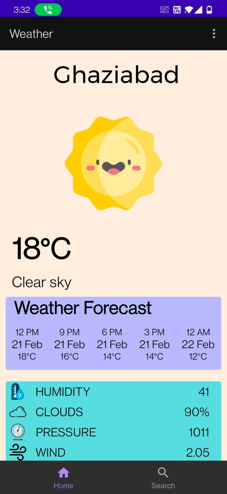
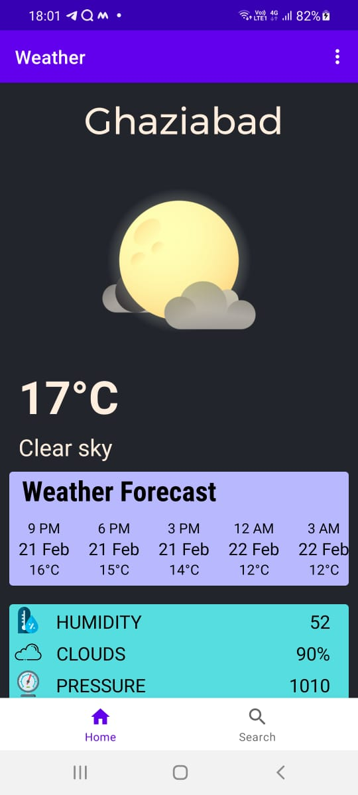
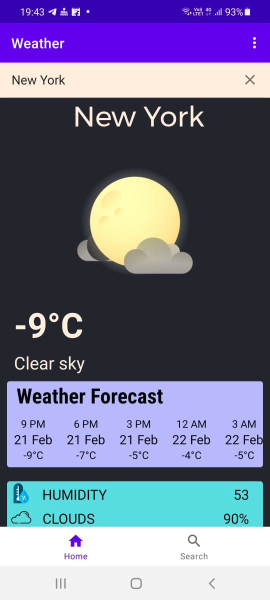

<h1 align="center">Weather App</h1>

<b>It shows the weather and even the forecast for the next 5 days and even important details like humidity, wind speed, pressure, etc. You can select your location by gps or by searching any city 
  </b>

 
## Tech and framework used

* Retrofit
* MVVM
* Kotlin
* RecyclerView

## API Used

* OpenWeatherMap

## Screenshots

  
 

 

 
   
  

  

  
    
   
